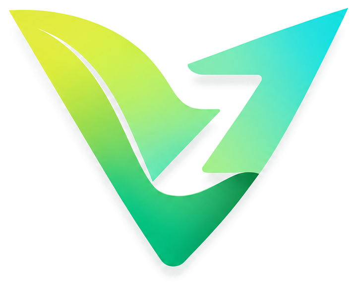
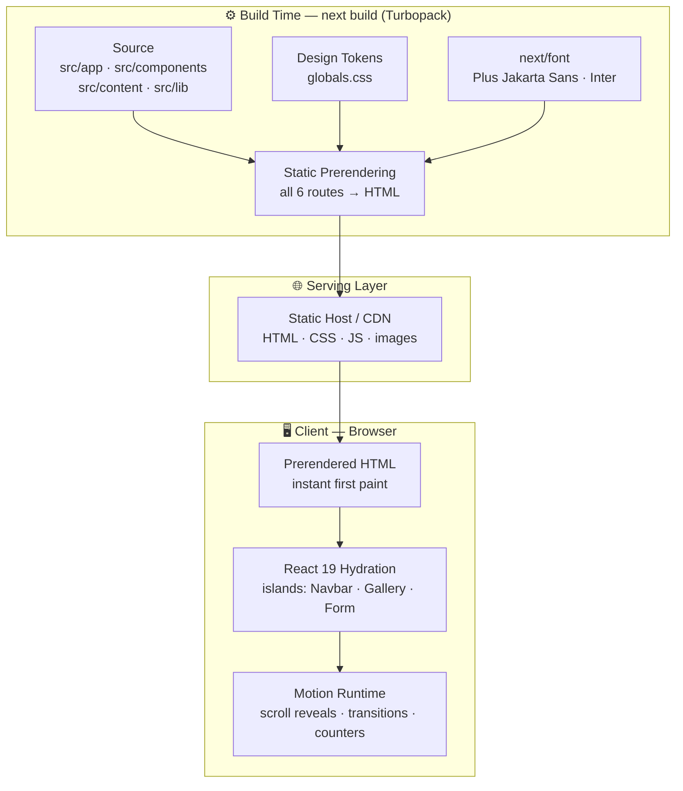
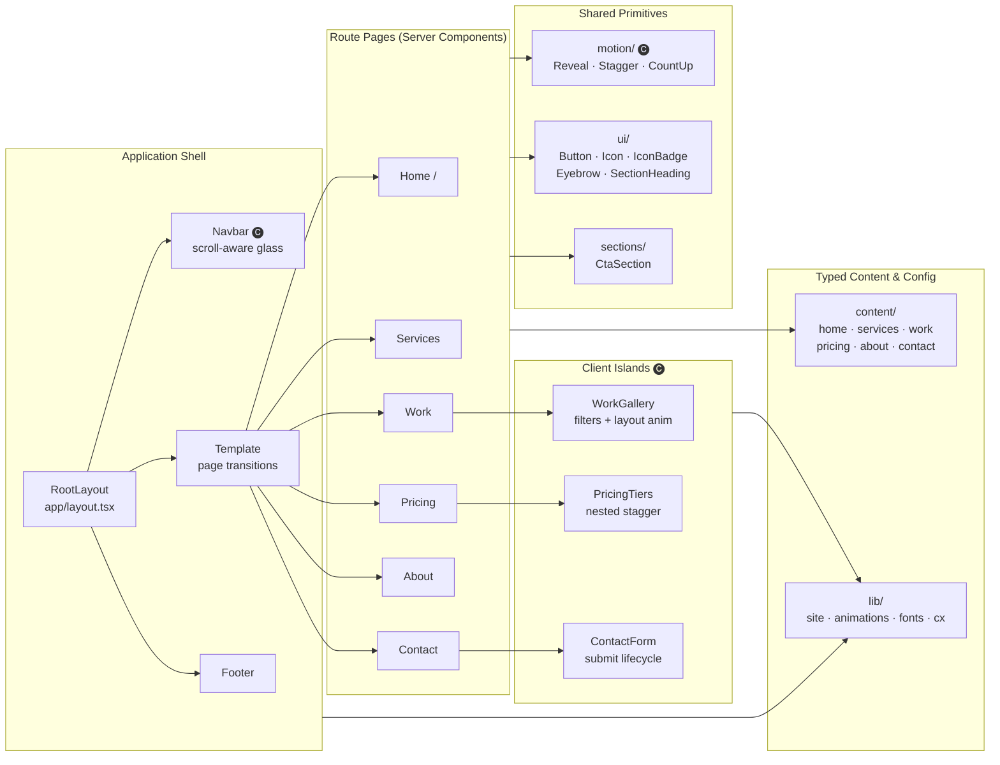
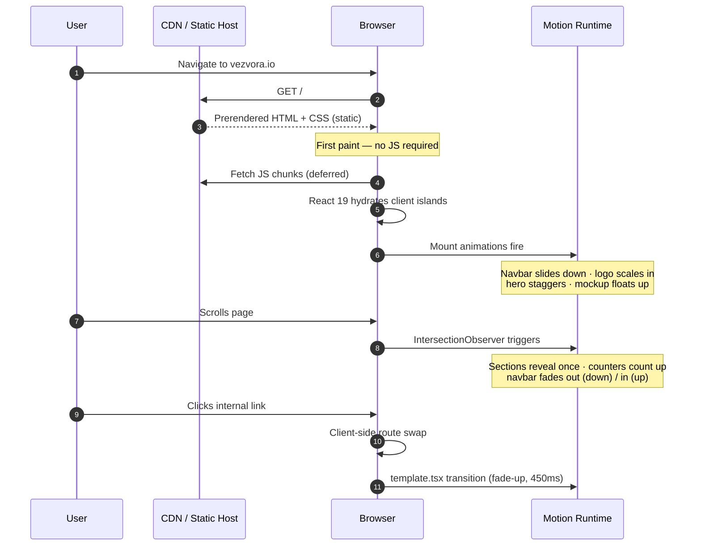
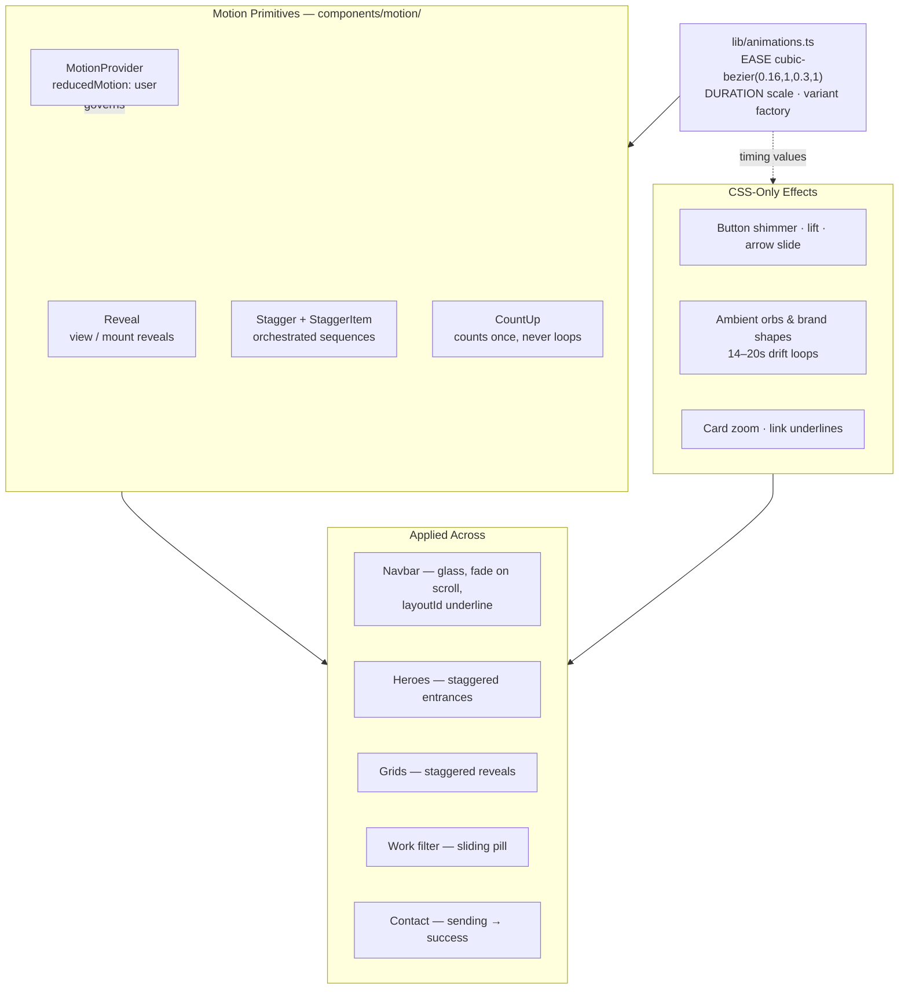
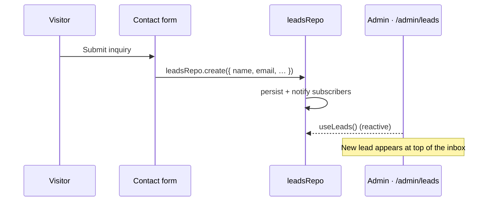

<div align="center">



# VEZVORA

**Software that moves your business forward.**

Corporate marketing platform for Vezvora — a premium software engineering studio
delivering mobile apps, web platforms, POS, and custom enterprise systems.

[](https://nextjs.org)
[](https://react.dev)
[](https://www.typescriptlang.org)
[](https://motion.dev)
[](https://nodejs.org)
[](#-license)

*This is a **closed-source, proprietary** project. Unauthorized copying,
distribution, or use of any part of this codebase is strictly prohibited.*

</div>

---

## 📑 Table of Contents

- [Overview](#-overview)
- [Tech Stack](#-tech-stack)
- [High-Level Architecture](#-high-level-architecture)
- [Component Architecture](#-component-architecture)
- [Rendering Pipeline](#-rendering-pipeline)
- [Animation System](#-animation-system)
- [Project Structure](#-project-structure)
- [Routes](#-routes)
- [Design System](#-design-system)
- [Getting Started](#-getting-started)
- [Available Scripts](#-available-scripts)
- [Quality & Performance](#-quality--performance)
- [Branding](#-branding)
- [License](#-license)

---

## 🔍 Overview

VEZVORA is a fully static, high-performance marketing site built on the
**Next.js App Router**. Every route is prerendered at build time, wrapped in a
single shared chrome (navbar + footer) so the template is pixel-identical on
every page, and animated with a centralized motion system inspired by premium
SaaS products.

**Key characteristics**

| Attribute        | Value                                                        |
| ---------------- | ------------------------------------------------------------ |
| Rendering        | 100% static prerendering (SSG) — no runtime data fetching     |
| Styling          | CSS Modules + global design-token layer                       |
| Motion           | Motion (Framer Motion) 12 with a single variant library       |
| Accessibility    | Semantic landmarks, `aria-current`, `prefers-reduced-motion`  |
| Type safety      | `strict` TypeScript across app, content, and components       |

---

## 🧰 Tech Stack

| Layer          | Technology                          | Purpose                                             |
| -------------- | ----------------------------------- | --------------------------------------------------- |
| Framework      | **Next.js 16** (App Router, Turbopack) | Routing, static generation, asset pipeline       |
| UI Runtime     | **React 19**                        | Server + client components                          |
| Language       | **TypeScript 5** (`strict`)         | End-to-end type safety                              |
| Styling        | **CSS Modules** + design tokens     | Scoped styles, one-place theming                    |
| Animation      | **Motion 12** (`motion/react`)      | Reveals, transitions, counters, layout animations   |
| Typography     | **next/font** — Plus Jakarta Sans, Inter | Self-hosted, zero-CLS fonts                    |
| Icons          | **lucide-react**                    | Tree-shakeable SVG icons (no icon font)             |
| Linting        | **ESLint 9** (flat config, `eslint-config-next`) | Code quality gates                     |

---

## 🏗 High-Level Architecture



The site ships **zero server-side runtime logic** — every route is emitted as
static HTML at build time and can be hosted on any static host or CDN.
Interactivity is limited to small, deliberate client islands.

---

## 🧩 Component Architecture



> 🅒 = client component. Everything else renders on the server — pages stay
> server components and *compose* client motion primitives, keeping the
> shipped JavaScript bundle minimal.

**Design principles**

1. **Single chrome** — `Navbar` and `Footer` live in the root layout only;
   no page re-implements them.
2. **Content/presentation split** — all copy lives in `src/content/*` as typed
   data; components are pure presentation.
3. **One motion vocabulary** — every animation resolves to variants defined in
   `src/lib/animations.ts`; no ad-hoc animation code in pages.

---

## 🔄 Rendering Pipeline



---

## 🎬 Animation System



**Motion rules enforced**

- Only 60fps-friendly properties animate: `opacity` and `transform`
- Reveals fire **once** (`viewport: { once: true }`) — content is never blocked
- `prefers-reduced-motion` honored twice: `MotionConfig reducedMotion="user"`
  for JS animations, a global CSS kill-switch for keyframe loops
- Micro-interactions 150–250ms · reveals 500–700ms · hero 700–1000ms ·
  ambient loops 14–20s

---

## 📁 Project Structure

```
vezvora/
├── public/
│   ├── logo.png                 # Full brand lockup (mark + wordmark)
│   └── logo-mark.png            # Transparent "V" mark (navbar/footer/README)
├── src/
│   ├── app/                     # Routes (App Router)
│   │   ├── layout.tsx           # Root layout — Navbar + Footer chrome
│   │   ├── template.tsx         # Route transition (fade-up)
│   │   ├── globals.css          # Reset + design tokens + keyframes
│   │   ├── icon.svg             # Favicon
│   │   ├── page.tsx             # Home
│   │   ├── services/            # Services
│   │   ├── work/                # Work (client gallery: filter + load-more)
│   │   ├── pricing/             # Pricing (client tiers: nested stagger)
│   │   ├── about/               # About
│   │   └── contact/             # Contact (client form: submit lifecycle)
│   ├── components/
│   │   ├── layout/              # Navbar · Footer · Logo
│   │   ├── motion/              # MotionProvider · Reveal · Stagger · CountUp
│   │   ├── sections/            # CtaSection
│   │   └── ui/                  # Button · Icon · IconBadge · Eyebrow · SectionHeading
│   ├── content/                 # Typed page copy — single source of truth
│   └── lib/                     # site config · animations · fonts · cx
├── eslint.config.mjs            # Flat ESLint config
├── next.config.mjs
└── tsconfig.json
```

---

## 🗺 Routes

| Route       | Page      | Highlights                                                  |
| ----------- | --------- | ----------------------------------------------------------- |
| `/`         | Home      | Hero + dashboard mockup, trust bar, services, featured work, process timeline, CTA |
| `/services` | Services  | Four detailed engagement cards (problem → solution → deliverables) |
| `/work`     | Work      | Filterable project gallery with animated pill + layout transitions |
| `/pricing`  | Pricing   | Three tiers, "Most popular" glow, discovery-sprint note      |
| `/about`    | About     | Mission hero, animated stats band, operating principles      |
| `/contact`  | Contact   | Validated inquiry form with sending → success lifecycle      |

---

## 🔐 Admin Console

A private operations console lives under `/admin`, sharing the marketing design
system (deep-slate sidebar, lime accents, Motion). Every `/admin/*` route is
gated by middleware; the marketing chrome is swapped out via `SiteChrome`.

| Route              | Purpose                                                                 |
| ------------------ | ----------------------------------------------------------------------- |
| `/admin/login`     | Server-action login → `httpOnly` session cookie                          |
| `/admin`           | Dashboard — KPIs, pipeline funnel, project-type & lead breakdown, recent leads |
| `/admin/leads`     | Leads inbox — search, status/owner filters, pipeline, detail drawer (notes, assignment, WhatsApp/email quick-reply), CSV export |
| `/admin/content`   | Work CMS — add / edit / reorder / feature-toggle / delete projects       |
| `/admin/settings`  | Site details, SEO defaults, and team                                     |

**Auth.** `src/middleware.ts` redirects unauthenticated `/admin/*` requests to
login; a server action (`src/lib/admin/auth-actions.ts`) validates credentials
and sets the session cookie. Demo password is `vezvora` (override with
the `ADMIN_PASSWORD` env var, e.g. in an untracked `.env.local`). Swap the credential check for a real user
store + hashed passwords for production.

**Data layer.** The console reads/writes through a small repository interface
(`src/lib/admin/store.ts` — `leadsRepo`, `projectsRepo`, `settingsRepo`), backed
by a reactive localStorage store for this prototype. Components depend only on
the hooks/mutations, so moving to a real API/DB is an internals-only change.

Public contact submissions flow straight into the console:



---

## 🎨 Design System

All theming is driven by CSS custom properties in
[`src/app/globals.css`](src/app/globals.css) — change a token once, the whole
site follows.

**Brand palette**

| Token             | Value                                   | Role                        |
| ----------------- | --------------------------------------- | --------------------------- |
| `--green`         | `#28B85F`                               | Primary brand green         |
| `--lime`          | `#B7DE1D`                               | High-visibility accent      |
| `--teal`          | `#2FD3C4`                               | Secondary accent            |
| `--ink`           | `#23282F`                               | Primary text / dark surfaces|
| `--bg`            | `#FAFBF8`                               | Page canvas                 |
| `--grad-accent`   | `linear-gradient(120deg, #8EC21A → #28B85F → #2FD3C4)` | Signature brand gradient |
| `--grad-dark`     | `linear-gradient(140deg, #1C2A24 → #23282F → #1A2B2C)` | Dark slate bands  |

**Typography**

| Face                  | Usage                                   |
| --------------------- | ---------------------------------------- |
| **Plus Jakarta Sans** | Display, headlines, body (400–800)       |
| **Inter**             | Labels, captions, data (400–600)         |

---

## 🚀 Getting Started

**Prerequisites**

- Node.js **≥ 20**
- npm **≥ 10**

**Setup**

```bash
# 1. Clone (authorized personnel only)
git clone https://github.com/Aakashwije/vezvora.git
cd vezvora

# 2. Install dependencies
npm install

# 3. Run the development server
npm run dev
# → http://localhost:3000
```

**Production build**

```bash
npm run build   # static prerender of all routes
npm run start   # serve the production build
```

---

## 📜 Available Scripts

| Script          | Description                                  |
| --------------- | -------------------------------------------- |
| `npm run dev`   | Start the dev server (Turbopack, HMR)        |
| `npm run build` | Production build — all routes prerendered    |
| `npm run start` | Serve the production build                   |
| `npm run lint`  | ESLint (flat config) across the project      |

---

## ✅ Quality & Performance

- **Static-first** — every route prerenders; TTFB is CDN-bound
- **Zero icon fonts / zero external font requests** — SVG icons + self-hosted fonts
- **Strict TypeScript** and ESLint gates on every build
- **Reduced-motion compliant** — JS and CSS animation layers both degrade
- **Layout-stable animations** — only `opacity`/`transform`, no CLS from motion

---

## 🖼 Branding

The brand mark is wired through a single component —
[`src/components/layout/Logo.tsx`](src/components/layout/Logo.tsx):

| Asset                   | Purpose                                        |
| ----------------------- | ---------------------------------------------- |
| `public/logo.png`       | Full lockup — social cards, print, docs        |
| `public/logo-mark.png`  | Transparent "V" mark — navbar, footer, favicon |

To rebrand, swap the asset (or its `src`) in one place; every page updates.

---

## 🔒 License

**Proprietary — All Rights Reserved.**

Copyright © 2026 VEZVORA.

This repository and its contents are the confidential and proprietary property
of VEZVORA. No part of this codebase — source code, designs, assets, or
documentation — may be copied, modified, distributed, sublicensed, or used in
any form, in whole or in part, without prior written authorization from
VEZVORA. Access is restricted to authorized personnel only.

---

<div align="center">


**VEZVORA** — Engineering digital momentum.
</div>
