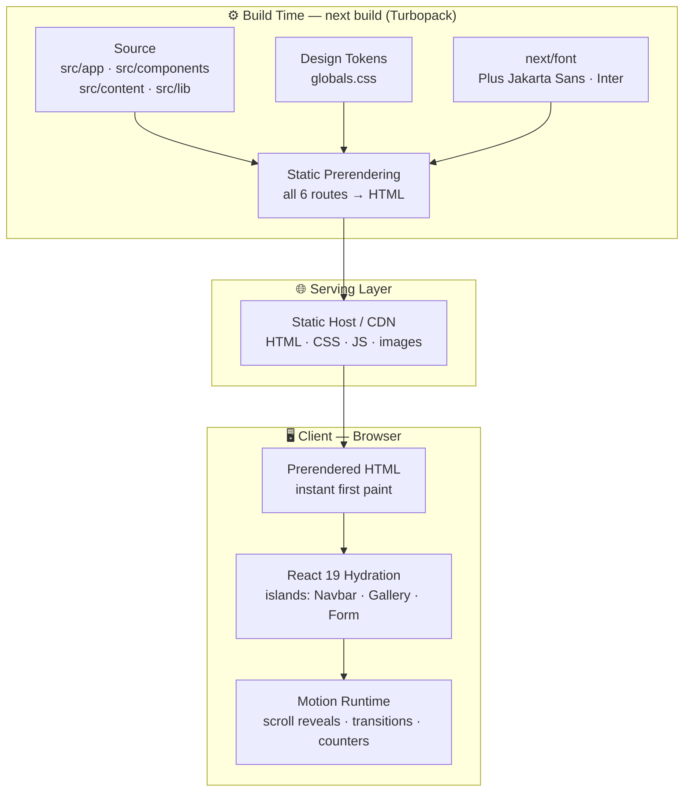
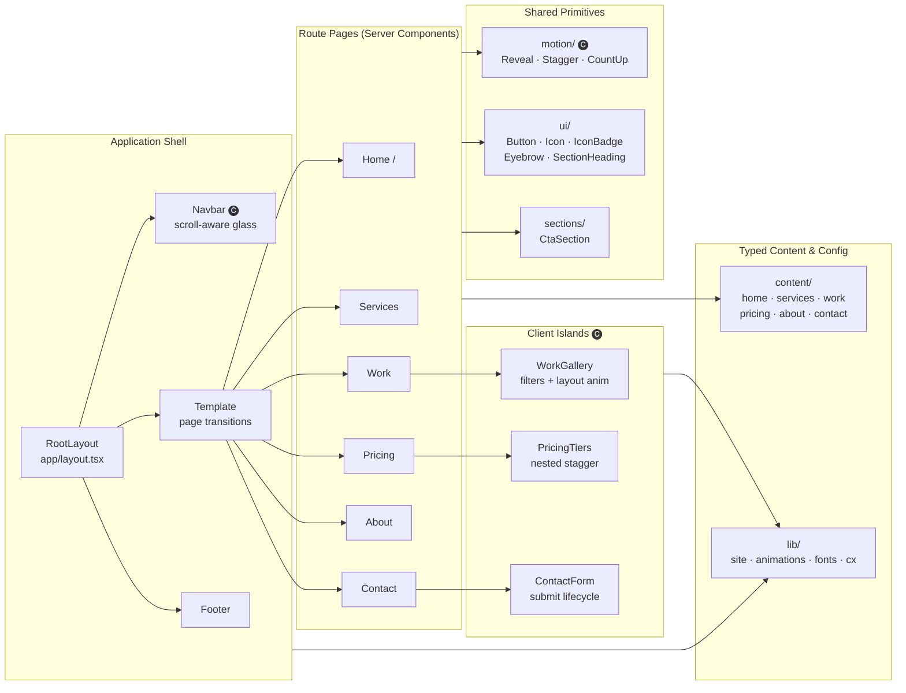
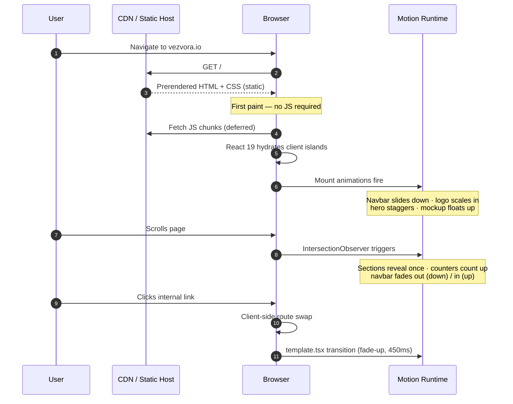
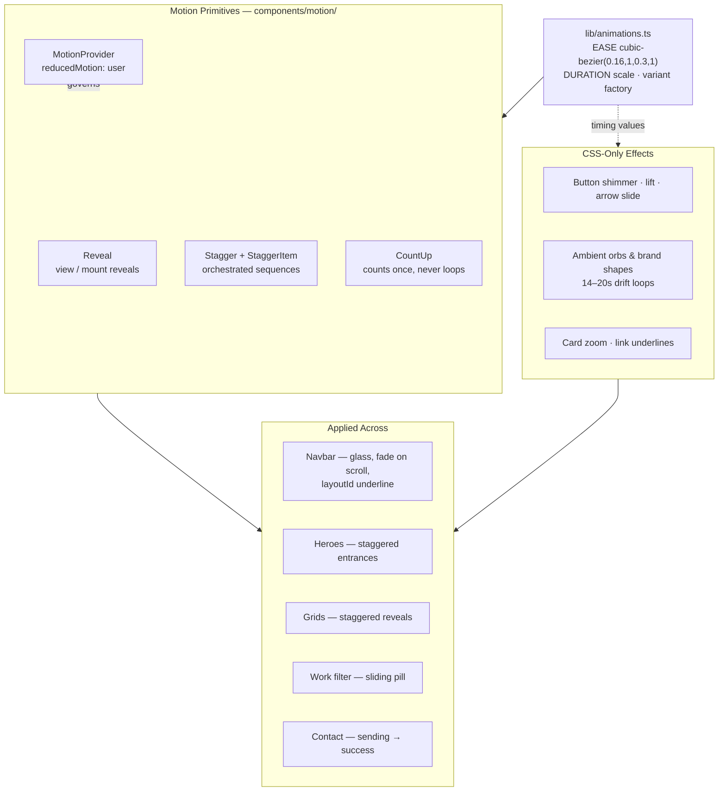
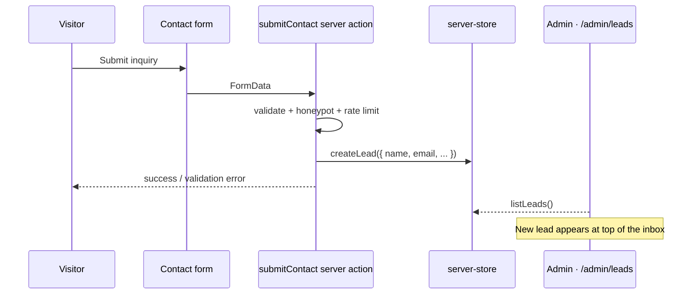

<div align="center">


# VEZVORA

**Software that moves your business forward.**

Corporate marketing platform for Vezvora — a premium software engineering studio
delivering mobile apps, web platforms, POS, and custom enterprise systems.

[](https://nextjs.org)
[](https://react.dev)
[](https://www.typescriptlang.org)
[](https://motion.dev)
[](https://nodejs.org)
[](#-license)

*This is a **closed-source, proprietary** project. Unauthorized copying,
distribution, or use of any part of this codebase is strictly prohibited.*

</div>

---

## 📑 Table of Contents

- [Overview](#-overview)
- [Tech Stack](#-tech-stack)
- [High-Level Architecture](#-high-level-architecture)
- [Component Architecture](#-component-architecture)
- [Rendering Pipeline](#-rendering-pipeline)
- [Animation System](#-animation-system)
- [Project Structure](#-project-structure)
- [Routes](#-routes)
- [Instant Estimate Quotations](#-instant-estimate-quotations)
- [Design System](#-design-system)
- [Getting Started](#-getting-started)
- [Available Scripts](#-available-scripts)
- [Quality & Performance](#-quality--performance)
- [Branding](#-branding)
- [License](#-license)

---

## 🔍 Overview

VEZVORA is a fully static, high-performance marketing site built on the
**Next.js App Router**. Public marketing routes are prerendered at build time,
wrapped in a single shared chrome (navbar + footer) so the template is
pixel-identical on every page, and animated with a centralized motion system
inspired by premium SaaS products. The private `/admin` console uses dynamic
server rendering for signed-cookie auth.

**Key characteristics**

| Attribute        | Value                                                        |
| ---------------- | ------------------------------------------------------------ |
| Rendering        | Static-first public pages + dynamic admin auth routes          |
| Styling          | CSS Modules + global design-token layer                       |
| Motion           | Motion (Framer Motion) 12 with a single variant library       |
| Accessibility    | Semantic landmarks, `aria-current`, `prefers-reduced-motion`  |
| Type safety      | `strict` TypeScript across app, content, and components       |

---

## 🧰 Tech Stack

| Layer          | Technology                          | Purpose                                             |
| -------------- | ----------------------------------- | --------------------------------------------------- |
| Framework      | **Next.js 16** (App Router, Turbopack) | Routing, static generation, asset pipeline       |
| UI Runtime     | **React 19**                        | Server + client components                          |
| Language       | **TypeScript 5** (`strict`)         | End-to-end type safety                              |
| Styling        | **CSS Modules** + design tokens     | Scoped styles, one-place theming                    |
| Animation      | **Motion 12** (`motion/react`)      | Reveals, transitions, counters, layout animations   |
| Typography     | **next/font** — Plus Jakarta Sans, Inter | Self-hosted, zero-CLS fonts                    |
| Icons          | **lucide-react**                    | Tree-shakeable SVG icons (no icon font)             |
| Linting        | **ESLint 9** (flat config, `eslint-config-next`) | Code quality gates                     |

---

## 🏗 High-Level Architecture


```mermaid
graph TB
    subgraph BUILD["⚙️ Build Time — next build (Turbopack)"]
        SRC["Source<br/>src/app · src/components<br/>src/content · src/lib"]
        TOKENS["Design Tokens<br/>globals.css"]
        FONTS["next/font<br/>Plus Jakarta Sans · Inter"]
        SSG["Static Prerendering<br/>all 6 routes → HTML"]
        SRC --> SSG
        TOKENS --> SSG
        FONTS --> SSG
    end

    subgraph SERVE["🌐 Serving Layer"]
        CDN["Static Host / CDN<br/>HTML · CSS · JS · images"]
    end

    subgraph CLIENT["🖥️ Client — Browser"]
        HTML["Prerendered HTML<br/>instant first paint"]
        HYDRATE["React 19 Hydration<br/>islands: Navbar · Gallery · Form"]
        MOTION["Motion Runtime<br/>scroll reveals · transitions · counters"]
        HTML --> HYDRATE --> MOTION
    end

    SSG --> CDN --> HTML
```

The public site ships as static HTML where possible and is CDN-friendly.
Server-side runtime logic is limited to the admin auth boundary and server
actions, which deploy cleanly on Vercel.

---

## 🧩 Component Architecture


```mermaid
graph LR
    subgraph SHELL["Application Shell"]
        LAYOUT["RootLayout<br/>app/layout.tsx"]
        TEMPLATE["Template<br/>page transitions"]
        NAV["Navbar 🅒<br/>scroll-aware glass"]
        FOOT["Footer"]
        LAYOUT --> NAV
        LAYOUT --> TEMPLATE
        LAYOUT --> FOOT
    end

    subgraph PAGES["Route Pages (Server Components)"]
        HOME["Home /"]
        SVC["Services"]
        WORK["Work"]
        PRICE["Pricing"]
        ABOUT["About"]
        CONTACT["Contact"]
        TEMPLATE --> HOME & SVC & WORK & PRICE & ABOUT & CONTACT
    end

    subgraph ISLANDS["Client Islands 🅒"]
        GALLERY["WorkGallery<br/>filters + layout anim"]
        TIERS["PricingTiers<br/>nested stagger"]
        FORM["ContactForm<br/>submit lifecycle"]
        WORK --> GALLERY
        PRICE --> TIERS
        CONTACT --> FORM
    end

    subgraph PRIMITIVES["Shared Primitives"]
        MOTIONP["motion/ 🅒<br/>Reveal · Stagger · CountUp"]
        UI["ui/<br/>Button · Icon · IconBadge<br/>Eyebrow · SectionHeading"]
        SECTIONS["sections/<br/>CtaSection"]
    end

    subgraph DATA["Typed Content & Config"]
        CONTENT["content/<br/>home · services · work<br/>pricing · about · contact"]
        LIB["lib/<br/>site · animations · fonts · cx"]
    end

    PAGES --> MOTIONP & UI & SECTIONS
    PAGES --> CONTENT
    SHELL --> LIB
    ISLANDS --> LIB
```

> 🅒 = client component. Everything else renders on the server — pages stay
> server components and *compose* client motion primitives, keeping the
> shipped JavaScript bundle minimal.

**Design principles**

1. **Single chrome** — `Navbar` and `Footer` live in the root layout only;
   no page re-implements them.
2. **Content/presentation split** — all copy lives in `src/content/*` as typed
   data; components are pure presentation.
3. **One motion vocabulary** — every animation resolves to variants defined in
   `src/lib/animations.ts`; no ad-hoc animation code in pages.

---

## 🔄 Rendering Pipeline


```mermaid
sequenceDiagram
    autonumber
    participant U as User
    participant C as CDN / Static Host
    participant B as Browser
    participant M as Motion Runtime

    U->>B: Navigate to vezvora.io
    B->>C: GET /
    C-->>B: Prerendered HTML + CSS (static)
    Note over B: First paint — no JS required
    B->>C: Fetch JS chunks (deferred)
    B->>B: React 19 hydrates client islands
    B->>M: Mount animations fire
    Note over M: Navbar slides down · logo scales in<br/>hero staggers · mockup floats up
    U->>B: Scrolls page
    B->>M: IntersectionObserver triggers
    Note over M: Sections reveal once · counters count up<br/>navbar fades out (down) / in (up)
    U->>B: Clicks internal link
    B->>B: Client-side route swap
    B->>M: template.tsx transition (fade-up, 450ms)
```

---

## 🎬 Animation System


```mermaid
graph TD
    CONST["lib/animations.ts<br/>EASE cubic-bezier(0.16,1,0.3,1)<br/>DURATION scale · variant factory"]

    subgraph PRIM["Motion Primitives — components/motion/"]
        PROVIDER["MotionProvider<br/>reducedMotion: user"]
        REVEAL["Reveal<br/>view / mount reveals"]
        STAGGER["Stagger + StaggerItem<br/>orchestrated sequences"]
        COUNT["CountUp<br/>counts once, never loops"]
    end

    subgraph CSSFX["CSS-Only Effects"]
        BTN["Button shimmer · lift · arrow slide"]
        ORB["Ambient orbs & brand shapes<br/>14–20s drift loops"]
        HOVER["Card zoom · link underlines"]
    end

    subgraph USAGE["Applied Across"]
        NAVA["Navbar — glass, fade on scroll,<br/>layoutId underline"]
        HERO["Heroes — staggered entrances"]
        GRID["Grids — staggered reveals"]
        FILTER["Work filter — sliding pill"]
        FORMA["Contact — sending → success"]
    end

    CONST --> PRIM --> USAGE
    CONST -.timing values.-> CSSFX --> USAGE
    PROVIDER -.governs.-> PRIM
```

**Motion rules enforced**

- Only 60fps-friendly properties animate: `opacity` and `transform`
- Reveals fire **once** (`viewport: { once: true }`) — content is never blocked
- `prefers-reduced-motion` honored twice: `MotionConfig reducedMotion="user"`
  for JS animations, a global CSS kill-switch for keyframe loops
- Micro-interactions 150–250ms · reveals 500–700ms · hero 700–1000ms ·
  ambient loops 14–20s

---

## 📁 Project Structure

```
vezvora/
├── public/
│   ├── logo.png                 # Full brand lockup (mark + wordmark)
│   └── logo-mark.webp           # Transparent "V" mark (navbar/footer/README)
├── src/
│   ├── app/                     # Routes (App Router)
│   │   ├── layout.tsx           # Root layout — Navbar + Footer chrome
│   │   ├── template.tsx         # Route transition (fade-up)
│   │   ├── globals.css          # Reset + design tokens + keyframes
│   │   ├── icon.svg             # Favicon
│   │   ├── page.tsx             # Home
│   │   ├── services/            # Services
│   │   ├── work/                # Work (client gallery: filter + load-more)
│   │   ├── pricing/             # Pricing (client tiers: nested stagger)
│   │   ├── about/               # About
│   │   └── contact/             # Contact (client form: submit lifecycle)
│   ├── components/
│   │   ├── layout/              # Navbar · Footer · Logo
│   │   ├── motion/              # MotionProvider · Reveal · Stagger · CountUp
│   │   ├── sections/            # CtaSection
│   │   └── ui/                  # Button · Icon · IconBadge · Eyebrow · SectionHeading
│   ├── content/                 # Typed page copy — single source of truth
│   └── lib/                     # site config · animations · fonts · cx
├── eslint.config.mjs            # Flat ESLint config
├── next.config.mjs
└── tsconfig.json
```

---

## 🗺 Routes

| Route       | Page      | Highlights                                                  |
| ----------- | --------- | ----------------------------------------------------------- |
| `/`         | Home      | Hero + dashboard mockup, trust bar, services, featured work, process timeline, CTA |
| `/services` | Services  | Four detailed engagement cards (problem → solution → deliverables) |
| `/work`     | Work      | Filterable project gallery with animated pill + layout transitions |
| `/pricing`  | Pricing   | Three tiers, "Most popular" glow, discovery-sprint note      |
| `/about`    | About     | Mission hero, animated stats band, operating principles      |
| `/contact`  | Contact   | Validated inquiry form with sending → success lifecycle      |
| `/quotation`| Estimate  | Five-step estimator that prices a project and emails a PDF quotation |

---

## 🔐 Admin Console

A private operations console lives under `/admin`, sharing the marketing design
system (deep-slate sidebar, lime accents, Motion). Every `/admin/*` route is
gated by middleware; the marketing chrome is swapped out via `SiteChrome`.

| Route              | Purpose                                                                 |
| ------------------ | ----------------------------------------------------------------------- |
| `/admin/login`     | Server-action login → `httpOnly` session cookie                          |
| `/admin`           | Dashboard — action centre, business KPIs, lead & quotation pipelines, recent leads |
| `/admin/leads`     | Leads inbox — search, status/owner filters, pipeline, detail drawer (notes, assignment, WhatsApp/email quick-reply), CSV export |
| `/admin/content`   | Work CMS — add / edit / reorder / feature-toggle / delete projects       |
| `/admin/settings`  | Site details, SEO defaults, and team                                     |

**Auth.** `src/proxy.ts` redirects unauthenticated `/admin/*` requests to
login; a server action (`src/lib/admin/auth-actions.ts`) validates credentials
and sets the session cookie. Admin auth fails closed until `ADMIN_PASSWORD` is
or `ADMIN_PASSWORD_HASH` is configured. Set `ADMIN_SESSION_SECRET` as a separate
strong random value in production. `ADMIN_PASSWORD_HASH` accepts
`scrypt:<saltHex>:<hashHex>` and is preferred over a plain environment password.

**Data layer.** The console reads/writes through a small repository interface
(`src/lib/admin/server-store.ts`). Local development uses server-side JSON at
`.data/admin-store.json`. Vercel deployments use Upstash Redis when either the
`UPSTASH_REDIS_REST_*` or `KV_REST_API_*` credential pair is configured. All
admin mutations go through authenticated server actions in
`src/lib/admin/actions.ts`.

### Dashboard

The overview answers two questions: *what needs me right now*, and *how is the
business doing*. Both are aggregated on the server in `src/lib/admin/dashboard.ts`
— the browser receives figures, not raw records to recompute.

**Action centre.** One queue of everything waiting on a person, ordered by
severity and then oldest-first, because the item that has waited longest is the
one most likely to be forgotten.

| Group | What it catches |
| ----- | --------------- |
| Failed delivery | A quotation the provider rejected |
| Needs approval | A quotation the confidence rules withheld |
| Sending soon | A cleared quotation inside ten minutes of its deadline |
| Unassigned leads | A new enquiry with no owner |
| Leads without follow-up | Contacted or qualified, untouched for five days |

Each row carries its decision inline — Review, Approve, Hold, Send, Retry, or
an owner picker — so routine cases never need the record opened. A quotation
contributes at most one row: an approval outranks its own countdown.

**KPIs** respect the period control (7 / 30 / 90 days, or a custom range), which
lives in the URL so it survives a refresh and can be sent to a colleague.
Pipeline value is deliberately a snapshot of everything unsent rather than a
range figure. *Lead to quotation* joins the two systems on the customer's email
address — the only identity both currently carry.

Public contact submissions flow straight into the console:


```mermaid
sequenceDiagram
    participant V as Visitor
    participant F as Contact form
    participant S as submitContact server action
    participant R as server-store
    participant A as Admin · /admin/leads
    V->>F: Submit inquiry
    F->>S: FormData
    S->>S: validate + honeypot + rate limit
    S->>R: createLead({ name, email, ... })
    S-->>V: success / validation error
    A-->>R: listLeads()
    Note over A: New lead appears at top of the inbox
```

---

## 🧾 Instant Estimate Quotations

A public estimator at **`/quotation`** (linked from `/pricing` and the footer)
collects a project brief, prices it server-side, stores the quotation, notifies
an administrator, and emails the customer a PDF quotation after a review window.

### Flow

```
Customer submits  →  validate + rate-limit  →  price (server-only rate card)
       ↓
save status pending_review  →  render PDF  →  notify admin  →  schedule job (T+10m)
       ↓
Admin may edit / approve / hold / cancel / send now      (10-minute window)
       ↓
At the deadline the worker reloads the record from the database:
  pending_review · updated · approved  →  send, if the confidence rules cleared it
  held · cancelled · sending · sent · failed  →  do nothing
```

Status workflow: `pending_review → updated → approved → sending → sent`, with
`held`, `cancelled` and `failed` as the off-ramps. Sending is claimed under a
per-record lock and stamped with an idempotency key, so a duplicated job, a
double click, or a QStash retry can never send twice.

### Confidence-based sending

Not every estimate should be emailed unattended. At submission the server
assesses the brief and records a verdict on the quotation; only estimates that
clear it are queued for the automatic worker. Everything else waits for an
administrator, indefinitely — a withheld quotation never enters the send queue,
so the deadline simply passes without incident.

**Always withheld** (no score can override):

- the estimate's upper bound reaches `autoSend.maxTotal` (default LKR 2,500,000)
- a bespoke service category (`autoSend.holdServices`, default custom / other)
- `autoSend.enabled: false`, which withholds every estimate

**Scored signals**, deducted from 100; below `autoSend.minScore` (default 70)
the estimate waits:

| Signal | Deduction |
| ------ | --------- |
| Description shorter than `minDescriptionChars` | 35 — enough on its own |
| Fewer than `minFeatures` feature areas | 20 |
| More integrations than `maxIntegrations` | 15 |
| More platforms than `maxPlatforms` | 15 |
| Urgent timeline | 10 |
| Estimate above the customer's stated budget band | 20 |

Confidence *level* describes the estimate; *autoSend* is the separate policy
question. A large, perfectly specified project scores highly and is still
withheld, because its size is what warrants a conversation.

**Releasing one.** Pressing **Approve** in the console releases the estimate: it
sends at the review deadline, or immediately if that has already passed — a
withheld quotation usually sits well past its window, and the delayed job for it
has long since fired and been skipped. **Send now** emails it at any point. Both
go through the same idempotent worker, and both are recorded in the audit
trail. Withheld requests are listed under the console's *Needs
approval* filter, the admin notification email is subject-lined
`Approval needed:`, and the row shows an approval prompt instead of a countdown.

Thresholds live in the rate card at `/admin/quotations/pricing` under
`autoSend`, so they are tunable without a deploy. A quotation keeps the verdict
it was given; changing the rules affects new submissions only. A record stored
before this feature existed, or with a malformed verdict, is treated as
unassessed and withheld — an estimate is never emailed on the strength of
missing data.

### Where the pieces live

| Path | Responsibility |
| ---- | -------------- |
| `src/content/quotation-options.ts` | Client-safe option catalogue (labels only, no prices) |
| `src/lib/quotation/validation.ts`  | Schema validation, normalization, max lengths |
| `src/lib/quotation/pricing-config.ts` | The rate card, and normalization of stored edits |
| `src/lib/quotation/pricing.ts`     | Deterministic engine: line items, totals, range, schedule |
| `src/lib/quotation/confidence.ts`  | Confidence scoring and the automatic-send rule |
| `src/lib/quotation/store.ts`       | Repository (Upstash Redis / JSON file / in-memory) |
| `src/lib/quotation/pdf.ts`         | A4 PDF renderer with letterhead background and pagination |
| `src/lib/quotation/email.ts`       | Resend delivery, branded HTML, PDF attachment |
| `src/lib/quotation/scheduler.ts`   | QStash publish + signature and cron-secret verification |
| `src/lib/quotation/dispatch.ts`    | The single send worker every trigger funnels through |
| `src/app/admin/(panel)/quotations` | Console: list, detail editor, rate-card editor |

### Database / storage

Quotations use the same Upstash Redis instance as the rest of the console, but
are stored as **one key per record** (`vezvora:quotation:v1:record:<id>`) with
sorted-set indexes for listing and for the due-job queue, plus `INCR` counters
for quotation numbers and `SET NX` locks for send claims. Per-record keys are
what make an administrator's edit and the auto-send worker safe to run at the
same time.

There is no migration step — the keys are created on first write. Locally, with
no Redis credentials, the store falls back to `.data/quotations.json`
(single-process development only). On Vercel without Redis it fails loudly
rather than writing to an ephemeral filesystem.

### Email setup (Resend)

1. Create a Resend account and verify your sending domain.
2. Set `RESEND_API_KEY`, `QUOTATION_FROM_EMAIL` (a verified sender),
   `QUOTATION_REPLY_TO`, and `QUOTATION_ADMIN_EMAIL`.

Without `RESEND_API_KEY` the app does not fail: it logs the message it would
have sent, so the whole workflow can be exercised locally.

### Scheduled jobs

Two independent mechanisms cover the review delay; both funnel into the same
idempotent worker, so a quotation covered by both is still sent once.

1. **Upstash QStash** (preferred, precise). Set `QSTASH_TOKEN`,
   `QSTASH_CURRENT_SIGNING_KEY` and `QSTASH_NEXT_SIGNING_KEY`. Submissions
   publish a delayed callback to `POST /api/quotations/dispatch`, which verifies
   the `upstash-signature` header before reading the body and **fails closed**
   when the keys are absent.
2. **Vercel Cron** (daily safety sweep). `vercel.json` schedules
   `/api/quotations/cron` once per day so the project remains deployable on the
   Vercel Hobby plan. It catches overdue records but does not guarantee the
   10-minute deadline. Vercel injects `CRON_SECRET` automatically; override it
   with `QUOTATION_CRON_SECRET`. Requests without the bearer secret get 401.

QStash is required for the precise 10-minute automatic send on Vercel Hobby.

Change the window with `QUOTATION_REVIEW_MINUTES` (default 10, clamped 1–1440).

### Letterhead

Drop the artwork at **`public/quotation/vezvora-letterhead.png`** — see
`public/quotation/README.md` for the full spec. In short: PNG, A4 proportions,
clear in the middle. It is drawn as a full-page background on every page,
including continuation pages, and content is laid out inside a safe area that
clears the header and footer bands.

To replace it, overwrite that file and redeploy; nothing else changes. Tune the
safe area with `QUOTATION_PDF_MARGIN_TOP` / `_BOTTOM` / `_LEFT` / `_RIGHT`
(points) if the new artwork has different bands. If the file is missing the app
logs a warning and renders a clean fallback layout instead of breaking.

`next.config.mjs` traces `public/quotation/**` into the serverless bundles that
render PDFs, since static assets are not included in function bundles by default.

### Pricing rules

The rate card is stored in the backend and edited at
**`/admin/quotations/pricing`** — base price per service, per-platform and
per-feature rates, integrations, design tiers, scalability, urgency surcharge,
maintenance, QA and project-management percentages, contingency, tax, discount
tiers, the schedule model, validity, payment terms, and the `autoSend` rules
that decide which estimates send unattended. Saving increments the
stored version, which is stamped on every quotation generated afterwards;
existing quotations keep the figures they were produced with. Anything invalid
in a saved edit falls back to the shipped default rather than producing broken
prices.

### Security

Server-side validation and normalization, HTML escaping in emails, a honeypot
field, per-IP rate limiting (`QUOTATION_RATE_LIMIT_MAX`, default 5 per 15
minutes), maximum input lengths, `requireAdmin()` on every admin action, signed
job callbacks, atomic send claiming, idempotent delivery, an audit trail on each
record, generic public error messages, and one-line JSON application logs.

Totals, prices, statuses, quotation numbers, review deadlines and the
confidence verdict are never accepted from the client — the browser sends
requirements, and the server decides everything else.

Sign-in throttling counts **failed** attempts only (5 per 15 minutes per IP and
email); a correct password clears the record, so signing in repeatedly never
locks an administrator out.

---

## 🎨 Design System

All theming is driven by CSS custom properties in
[`src/app/globals.css`](src/app/globals.css) — change a token once, the whole
site follows.

**Brand palette**

| Token             | Value                                   | Role                        |
| ----------------- | --------------------------------------- | --------------------------- |
| `--green`         | `#28B85F`                               | Primary brand green         |
| `--lime`          | `#B7DE1D`                               | High-visibility accent      |
| `--teal`          | `#2FD3C4`                               | Secondary accent            |
| `--ink`           | `#23282F`                               | Primary text / dark surfaces|
| `--bg`            | `#FAFBF8`                               | Page canvas                 |
| `--grad-accent`   | `linear-gradient(120deg, #8EC21A → #28B85F → #2FD3C4)` | Signature brand gradient |
| `--grad-dark`     | `linear-gradient(140deg, #1C2A24 → #23282F → #1A2B2C)` | Dark slate bands  |

**Typography**

| Face                  | Usage                                   |
| --------------------- | ---------------------------------------- |
| System UI stack       | Display, headlines, body                 |
| Inter/system stack    | Labels, captions, data                   |

---

## 🚀 Getting Started

**Prerequisites**

- Node.js **24.x**
- npm **≥ 10**

**Setup**

```bash
# 1. Clone (authorized personnel only)
git clone https://github.com/Aakashwije/vezvora.git
cd vezvora

# 2. Install dependencies
npm install

# 3. Run the development server
npm run dev
# → http://localhost:3000
```

**Production build**

```bash
npm run build   # static prerender of all routes
npm run start   # serve the production build
```

**Vercel deployment**

1. Import the GitHub repository into Vercel.
2. Keep the detected framework as **Next.js**. The included `vercel.json` uses
   the committed lockfile through `npm ci` and runs `npm run build`.
3. In the Vercel project, open **Storage**, add the **Upstash Redis** Marketplace
   integration, connect it to Production and Preview, then redeploy. It injects
   the `KV_REST_API_URL` and `KV_REST_API_TOKEN` credentials used by the app.
4. Add production environment variables:

```bash
ADMIN_PASSWORD_HASH=scrypt-salt-and-hash
# ADMIN_PASSWORD=use-a-strong-password # local/dev fallback only
ADMIN_SESSION_SECRET=use-a-long-random-secret
CONTACT_WEBHOOK_URL=https://example.com/new-lead-webhook
NEXT_PUBLIC_PLAUSIBLE_ENABLED=false
# NEXT_PUBLIC_PLAUSIBLE_DOMAIN=vezvora.io
# NEXT_PUBLIC_PLAUSIBLE_HOST=https://plausible.io

# Instant Estimate quotations — see the section above for details
RESEND_API_KEY=re_xxxxxxxx
QUOTATION_FROM_EMAIL="Vezvora <quotations@vezvora.io>"
QUOTATION_REPLY_TO=vezvoraa@gmail.com
QUOTATION_ADMIN_EMAIL=vezvoraa@gmail.com
QUOTATION_REVIEW_MINUTES=10
QSTASH_TOKEN=
QSTASH_CURRENT_SIGNING_KEY=
QSTASH_NEXT_SIGNING_KEY=
```

5. The included `vercel.json` registers a Hobby-compatible daily safety sweep.
   Configure QStash for the precise 10-minute callback. Vercel supplies
   `CRON_SECRET` to scheduled invocations automatically; add it to the project's
   environment variables so the cron route can verify it.
6. Place the letterhead at `public/quotation/vezvora-letterhead.png` before
   deploying, or quotations will use the fallback layout.

7. Deploy. The build output should show static public routes and dynamic
   `/admin`, `/api/quotations/*` routes.

Copy `.env.example` to `.env.local` for local configuration. Generate a secure
admin password hash without putting the plain password in source control:

```bash
node --input-type=module -e "import { scryptSync, randomBytes } from 'node:crypto'; const salt=randomBytes(16); const hash=scryptSync(process.argv[1], salt, 64); console.log('scrypt:'+salt.toString('hex')+':'+hash.toString('hex'))" "your-password"
```

---

## 📜 Available Scripts

| Script          | Description                                  |
| --------------- | -------------------------------------------- |
| `npm run dev`   | Start the dev server (Turbopack, HMR)        |
| `npm run build` | Production build for Vercel / Next runtime   |
| `npm run start` | Serve the production build                   |
| `npm run lint`  | ESLint (flat config) across the project      |
| `npm run typecheck` | TypeScript, no emit                      |
| `npm test`      | Unit tests (`node --test`)                   |
| `npm run test:e2e` | Production build, then the Playwright suite |

---

## ✅ Quality & Performance

- **Static-first** — public routes prerender; admin routes stay dynamic for auth
- **Zero icon fonts / zero external font requests** — SVG icons + self-hosted fonts
- **Strict TypeScript** and ESLint gates on every build
- **Reduced-motion compliant** — JS and CSS animation layers both degrade
- **Layout-stable animations** — only `opacity`/`transform`, no CLS from motion

---

## 🖼 Branding

The brand mark is wired through a single component —
[`src/components/layout/Logo.tsx`](src/components/layout/Logo.tsx):

| Asset                   | Purpose                                        |
| ----------------------- | ---------------------------------------------- |
| `public/logo.png`       | Full lockup — social cards, print, docs        |
| `public/logo-mark.webp` | Transparent "V" mark — navbar, footer, favicon |

To rebrand, swap the asset (or its `src`) in one place; every page updates.

---

## 🔒 License

**Proprietary — All Rights Reserved.**

Copyright © 2026 VEZVORA.

This repository and its contents are the confidential and proprietary property
of VEZVORA. No part of this codebase — source code, designs, assets, or
documentation — may be copied, modified, distributed, sublicensed, or used in
any form, in whole or in part, without prior written authorization from
VEZVORA. Access is restricted to authorized personnel only.

---

<div align="center">


**VEZVORA** — Engineering digital momentum.
</div>
